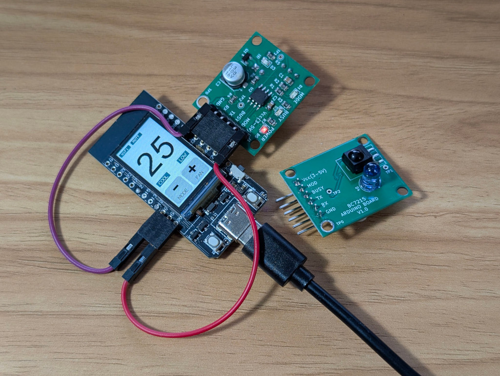

# BC7215AC Offline Universal Air Conditioner IR Remote Control Library For Arduino

[[简体中文](./extras/doc/README_CN.md)]

This library uses BC7215A chip as it's core functioning component and can let your Arduino control almost any air conditioner available on the market (see [**Supported Brand List**](./extras/doc/BC7215AC_supported_list.md)), and all runs locally with a small footprint, no online database is needed! The library leverages the BC7215A's ability to decode/transmit IR signal in arbitrary format, and can recognise and pair with any air conditioner with one click. 

**Relative Documents:**

[BC7215A datasheets](./extras/doc/bc7215_en.pdf)

[Schematic of the BC7215A IR transceiver board](./extras/doc/bc7215_arduino_board.pdf) 

This is the Arduino encapsulation of the same library's C version, making it work seamlessly with Arduino through simple function calls. The library supports key air conditioner operations: temperature adjustment, mode selection, fan speed control, and power on/off.

Though the [**User Manual**](./extras/doc/BC7215AC_arduino_ac_lib.pdf) (pdf) available in the document directory provides more details, the best way to learn about this library is to follow the examples. There are 5 examples provided with the library, and each one has both English and Chinese versions:

- ESP8266 Serial Monitor Blocking Version
- ESP8266 Serial Monitor Non-Blocking Version
- ESP32 Serial Monitor Version
- ESP32 LCD Version
- ESP32 MQTT IoT Version

It's recommended to start with the ESP8266 or ESP32 serial monitor examples to get familiar with the library functions, then progress to LCD and MQTT versions for more advanced integrations.

"**ESP8266 Serial Monitor Blocking Version**" is the simplest application, using software serial for communication with the BC7215A and the Arduino IDE serial monitor for user interaction. It demonstrates basic sampling, initialization, and control in a straightforward blocking design.

"**ESP8266 Serial Monitor Non-Blocking Version**" builds on the blocking version but uses a non-blocking design for more efficient logic, still interacting via the serial monitor.

"**ESP32 Serial Monitor Version**" is port of the ESP8266 non-blocking example, adapted for ESP32 hardware.

"**ESP32 LCD Version**" utilize the LILYGO T-Display's onboard buttons and LCD for a user-friendly interface, demonstrating control without relying on a computer.

"**ESP32 MQTT IoT Version**" extend the LCD version with networking capabilities, allowing MQTT-based remote control and status reporting for IoT applications.

Please see [**A/C Control Examples**](./extras/doc/AC_control_examples.md) (markdown) for detailed information about the examples. Or the [**PDF version**](./extras/doc/AC_control_examples.pdf) if you prefer.

## Other Documents:

This A/C remote control library comes with the BC7215 chip driver library as a low level driver,  Here are the relative documents:

[**LIBRARY README FILE**](./extras/doc/README_BC7215_DRIVER.md)

