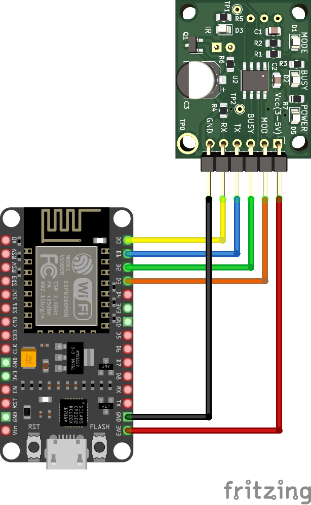

# BC7215AC  A/C Control Examples

---

The **BC7215AC Air Conditioner Remote Control Library** provides 5 example applications, each available in both English and Chinese versions:  

- ESP8266 Serial Monitor (Blocking)  
- ESP8266 Serial Monitor (Non-blocking)  
- ESP32 Serial Monitor  
- ESP32 LCD  
- ESP32 MQTT  

The **Serial Monitor version** is the simplest demo. It only requires connecting any ESP8266 or ESP32 Arduino development board to the BC7215A IR transceiver module, then using the Arduino IDE’s built-in Serial Monitor as the human–machine interface to control the air conditioner.  

The **LCD** and **MQTT** versions require the LilyGO TTGO T-Display ESP32 board, which comes with a built-in LCD display and two physical buttons. These hardware features allow the demo programs to run independently without a PC.  

The **MQTT version** builds on the LCD version by adding MQTT networking support. This enables users to test network-based air conditioner control via a public MQTT broker. The MQTT version still retains local button control and can report the updated air conditioner state to the MQTT server.  

The examples use ESP8266 NodeMCU boards and ESP32 TTGO T-Display boards. The hardware connections are as follows:  

**ESP8266:**  

- GPIO5 → BC7215A TX  
- GPIO16 → BC7215A RX  
- GPIO0 → BC7215A MOD  
- GPIO4 → BC7215A BUSY  
- 3.3V → BC7215A VCC  



**ESP32:**  

- GPIO25 → BC7215A TX  
- GPIO33 → BC7215A RX  
- GPIO27 → BC7215A MOD  
- GPIO26 → BC7215A BUSY  
- 3.3V → BC7215A VCC  


---

## Serial Monitor Version

This version uses the Arduino IDE Serial Monitor (baud rate: 115200). Three program variants are provided:  

- ESP8266 Blocking  
- ESP8266 Non-blocking  
- ESP32  

The **blocking version** is simplest in logic: the program loops indefinitely until a condition is met (e.g., waiting for user input). It’s useful for understanding the library’s workflow.  
The **non-blocking version** uses a state machine so tasks can proceed in parallel without getting stuck.  
The **ESP32 version** is a port of the ESP8266 non-blocking version.  

After uploading the program, the main menu appears in the Serial Monitor. If not, simply press Enter or reset the Arduino board.  


### Initialization

First-time use requires **sampling the original air conditioner remote control**. The collected data is used to initialize the library. The process is step-by-step, guided on-screen. If initialization fails repeatedly, the AC model may be one of the rare types that BC7215A cannot directly decode. In this case, you can try using **predefined protocols** to test control.  


### A/C Control

Once initialized successfully, you can start controlling the AC through a **two-level menu**:  

1. Choose control type (parameters such as temperature, or power on/off).  
2. Enter parameter values (temperature, mode, fan speed).  


---

## ESP32 LCD Version

This version uses the TTGO T-Display Arduino board (135×240 ST7789 LCD). It relies on **Bodmer’s TFT_eSPI library**, installable via Arduino IDE Library Manager.  
You must configure the library by replacing `User_Setup.h` in TFT_eSPI with the one provided in the `extras/config` directory of the BC7215AC library.  

When the program runs for the first time, the menu appears:  

- Left button (**SEL**) selects items.  
- Right button (**OK**) confirms.   


### Initialization

First, perform initialization by sampling the AC remote.  


If successful, the program enters the **AC control page**:  


**Button functions:**  

- Left short press: Decrease temperature  
- Right short press: Increase temperature  
- Left long press: Switch mode  
- Right long press: Switch fan speed  
- Double short press: Enter power control page (left = power on, right = power off)  
- Double long press: Enter main menu  

Whenever an action changes AC state, BC7215A transmits the corresponding IR signal, and an indicator appears at the top-right of the screen.  

---

## ESP32 MQTT Version

The MQTT version extends the LCD version with:  

1. **MQTT-based network control**  
2. **Air conditioner status reporting**  

It uses **Nick O’Leary’s PubSubClient library** (available in Arduino IDE Library Manager).  

### 1. Preparation Before Compilation

Before compiling, uncomment the following lines in the source and replace with your own values:  

```cpp
// WiFi and device configuration - replace with your values
#define MY_WIFI_SSID     "Your WiFi Name"
#define MY_WIFI_PASSWORD "Your WiFi Password"
#define MY_UUID          "Your UUID"
```

Use a UUID generator to create a unique device ID. If two devices share the same UUID, one will be disconnected by the MQTT server.  
Example UUID: `b1225e25-81c8-43d7-8183-6f5793408242`  

Default MQTT broker: `broker.hivemq.com`  
(You may also use public brokers such as `broker.emqx.io`).  

⚠️ **Note:** This demo uses an unencrypted connection. For production, use TLS-encrypted MQTT.  

---

### 2. Network-Controlled AC

On startup, the device connects to WiFi, then to the MQTT server. Once connected, WiFi and MQTT icons appear on the screen.  


**MQTT Topics:**  

- Temperature: `BC7215A/<UUID>/var/temp`  
- Mode: `BC7215A/<UUID>/var/mode`  
- Fan speed: `BC7215A/<UUID>/var/fan`  
- Power: `BC7215A/<UUID>/var/power`  

Example:  
`BC7215A/b1225e25-81c8-43d7-8183-6f5793408242/var/temp`  

**Message formats:**  

- **Temperature:** `"16"` – `"30"`  
- **Mode:**  
  - 0 = Auto  
  - 1 = Cool  
  - 2 = Heat  
  - 3 = Dry  
  - 4 = Fan  
- **Fan:**  
  - 0 = Auto  
  - 1 = Low  
  - 2 = Medium  
  - 3 = High  
- **Power:**  
  - 0 = Off  
  - 1 = On  

---

### MQTT Client

Most free public brokers provide web or desktop MQTT clients. Any client can publish control messages as long as it connects to the same server and topics.  

Example HiveMQ web client:  
[https://www.hivemq.com/demos/websocket-client/](https://www.hivemq.com/demos/websocket-client/)  


---

### AC Status Reporting

Whenever an IR command is sent (via button or MQTT), the new AC state is also reported to the MQTT server. Clients subscribed to the **report topic** will receive updates:  

`BC7215A/<UUID>/var/report`  
