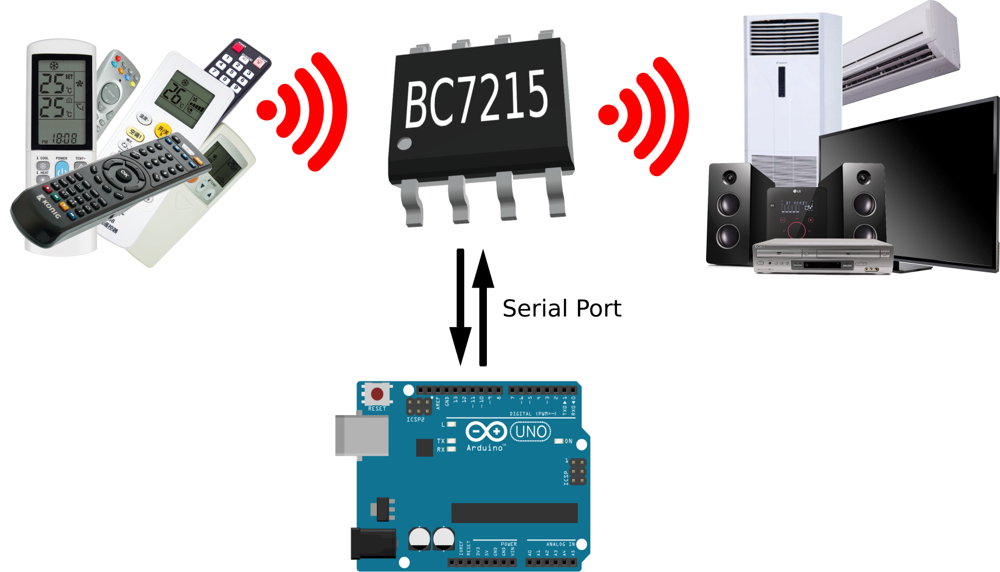

# Arduino Library For BC7215(A) Universal IR encoder/decoder

The BC7215(A) chip serves as a comprehensive solution for encoding (transmitting) and decoding (receiving) infrared remote control signals, supporting an extensive range of common infrared remote formats. It boasts an automatic recognition system for infrared signal encoding formats, ensuring compatibility with over 99.5% of air conditioner remotes and more than 98% of audiovisual device remotes.

BC7215 comes in 2 variants BC7215 & BC7215A, they are compatible in all aspect only except the A version use a 36ms gap to separate IR signals while the BC7215 version uses 18ms, this makes the A version more suitable to decode Aircon IR signals. Hereinafter both variants are referred to as BC7215 for simplicity.

BC7215 has the ability to output and input the original raw data, and a separate 33 bytes format packet contains all the information needed for data modulation. This makes BC7215 suitable for data communication and can be used in low spec systems such as Arduino UNO. Please refer to the [**BC7215 datasheets**](./bc7215_en.pdf) for more detailed information about BC7215.

This library makes BC7215 work with any Arduino as simple as making a few function calls. 

The best way to learn about this library is to follow the examples. There are 4 examples provided with the llbrary:

- IR Remote Signal Decoder
- 2-channel Remote Control Switch
- 4-key Programmable Remote Control
- IR Data Communication

It's recommended to follow the above sequence to get familiar with the library functions. 

"**IR Remote Signal Decoder**" is the simplest application,  which will do nothing but displays the original data decoded from received IR signals on Arduino IDE's serial monitor. 

"**2-channel Remote Control Switch**" is also a receiving(decoding) only application. It accept any IR signal from any remote control, and 2 independent IR signal data can be stored in Arduino. The Arduino will then monitor the received IR signal and compare the data with those 2 pre-stored, if it matches one of them, Arduino will drive the corresponding relay to toggle. With this application you can use the spare keys on your remote to control 2 switches.

"**4-key Programmable Remote Control**" implements a simple 4-key programmable remote control that can 'learn' and 'replicate' any remote control, even from different make or model.

"**IR Data Communication**" best to be used with 2 BC7215 and Arduinos, so you can see what data is received from the other side. The circuit have 2 buttons to send data with and without CRC checksum, when it's not sending, the circuit is in receiving mode, and will display any received data on serial monitor.

Please see [**BC7215 Arduino Library Examples**](./bc7215_examples.md) (markdown) for detailed information about the examples. Or the [**pdf version**](./bc7215_arduino_examples_en.pdf) if you like.

See here for the full documentation of the [**BC7215 Arduino Library Manual](./bc7215_arduino_lib.md) (Markdown Version) or ([**Pdf Version**](./bc7215_arduino_lib_en.pdf)).
