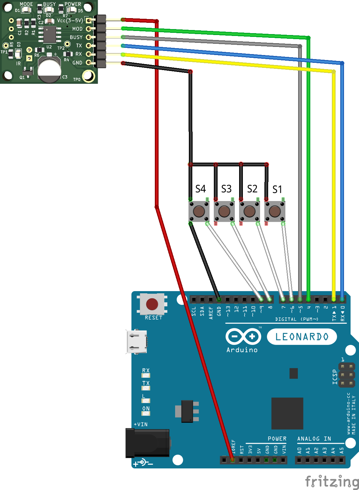

# BC7215 Arduino Library Examples

The BC7215 Arduino Library provides four examples of applications, which are:

- **Remote Control Decoding**
  
  - This example decodes the raw data from signals received from an IR remote control and outputs it to the serial monitor. It's useful for understanding the data structure of different remote controls and for debugging purposes.

- **Programmable Remote Control**
  
  - This is an example of a programmable IR remote control with four buttons, each capable of learning signals from different brands of remote controls. It demonstrates how to use the BC7215 to store and replicate the functionality of multiple remote control in one device, making it a versatile tool for managing various appliances.

- **2-Channel Infrared Remote Switch**
  
  - This example can "pair" with any remote control, allowing the use of spare buttons on a household remote to control power switches remotely. It showcases how to utilize the BC7215 to integrate into home automation projects, providing a practical application for extending the utility of existing remote controls.

- **Infrared Data Transmission**
  
  - This application uses the BC7215 as an infrared transceiver for data transmission. It exemplifies how to use the BC7215 for non-standard communication tasks, enabling the creation of custom infrared communication protocols for specific needs, such as simple sensor data exchange or remote control commands beyond the typical consumer electronics use.

These examples cover a broad range of potential uses for the BC7215 in projects, from simple signal decoding to more complex applications like learning remotes and custom data transmission, highlighting the versatility and utility of the BC7215 chip when combined with Arduino.

## Remote Control Decoding

This is a simple application where the BC7215 is always in receiving mode, with the BC7215's MOD pin permanently connected to VCC, and BUSY left unconnected. The Arduino displays the raw data of the infrared remote control signals received on the serial monitor. This application can be used with any Arduino board, but it requires that, aside from the Serial port used for communication with the computer, there's an available serial port for connecting the BC7215.

Example connection diagram using Arduino Leonardo:

## Programmable Remote Control

This application example demonstrates how to use an Arduino in conjunction with the BC7215 to create a simple universal learning infrared remote control with four buttons. Each button can learn to mimic the key of any remote control format, allowing each to learn from different brands and models to control various devices.

This example can be used with any Arduino board. For boards with only one serial port like the UNO, it is necessary to temporarily disconnect the BC7215 during program upload to avoid serial port conflict. If a serial port other than Serial (e.g., Serial1) is used for connecting to the BC7215, some auxiliary information can be seen on the computer's serial monitor. The example uses the board's built-in LED (digital I/O pin 13); if an LED is connected to another I/O pin, the program should be modified accordingly.

The connection circuit is as follows (using Arduino Leonardo board):

### Usage

The example program implements a 4-button learning remote control. The program operates in two modes: transmission mode and learning mode. Upon powering up, it defaults to transmission mode, with the LED flashing briefly at an interval of approximately 1.6 seconds to indicate it's in transmission mode. If a button has already been programmed (the content is empty after powering up, and the button will not respond), pressing a button will transmit the code of the learned remote control button.

In transmission mode, pressing S1 and S2 simultaneously enters learning mode. In this mode, the program puts the BC7215 into receiving state, and the LED on I/O 13 flashes rapidly to signal that it's in learning mode. Then, selecting one of the S1-S4 buttons indicates that the learning content will be stored under that button. After selecting a button, the LED will stay lit. In this state, point a remote control at the BC7215's infrared receiver and press a button. If the BC7215 successfully receives and decodes the signal, the format and content of that remote control button will be saved, and the demonstration program will return to transmission mode. Now, pressing the same button will transmit the learned button's signal.

The demonstration program is designed so that each button has associated storage for both the infrared control format and the raw data, allowing for the storage of 4 different formats (from different manufacturers or models) of remote control signals. If storing only different buttons from the same remote control, users can modify the program to save only one copy of format information, saving memory. Additionally, for simplicity, the example uses arrays of 4 maximum size raw data packets for storage. If users wish to save memory, they can dynamically allocate memory based on the length of the raw data for each button.

> Note: Some remote control formats, such as RC5 and RC6, include a toggle bit in the data transmitted with each button press, which flips with each press. The learning remote control program, for simplicity, does not handle this feature. In tests, remote controls using the RC5/RC6 codes may be rejected by the receiving device if it expects the toggle bit's polarity to flip, depending on the design of the receiving device. If users require full replication of the original remote control's functionality, additional functionality for flipping the toggle bit must be implemented.

## 2-Channel Infrared Remote Switch

This application demonstrates the use of the BC7215 to create a universal infrared control switch. Every household has various infrared remotes, and typically, there are some buttons on each remote that are never used. This BC7215 application allows these unused infrared remote buttons to be repurposed as infrared remote control for power switches. This 2-channel remote-controlled switch can use any spare button from any remote as a control.

This example can be used with any Arduino board. If used on a board other than the UNO, which has additional serial ports (like Serial1), then some extra information about the program's operation can be seen on the computer's serial monitor. The program uses the onboard LED (digital I/O 13) for LED display output, but users can also modify the program to use other I/O pins.

The connection diagram is as follows (using the Arduino Leonardo board as an example):

### Usage

The example program implements a 2-channel universal infrared remote switch. The circuit itself has two buttons, each controlling the learning function of one of the two channels. Each channel can learn and remember (pair) a button from any remote control. After learning, when the infrared signal from this button is received again, it will toggle the corresponding relay switch, achieving the purpose of turning an electrical device on or off.

The program operates in two modes: normal mode and learning mode. Upon powering up, it defaults to normal mode, with the LED flashing briefly at an interval of approximately 3.2 seconds to indicate it's in normal mode. When a user presses one of the buttons, the LED stays on, indicating it has entered the learning (pairing) mode. At this point, sending an infrared signal from a remote control to the device will save that signal's information, and the program returns to normal mode. Afterwards, if the infrared signal from the same button is received again, it will toggle the corresponding relay switch.

## Infrared Data Transmission

This application demonstrates using the BC7215 as an infrared transceiver for infrared data transmission. Infrared remote controls, as widely used electronic devices, have proven communication reliability, although their communication rate is relatively low. This makes them suitable for transmitting small amounts of data where speed is not critical, such as sensor data, command data, etc. The example shows both using CRC checksum and not using CRC checksum for data transmission.

This example can be used with any Arduino board. If used on a board other than the UNO, which has an additional serial port (like Serial1), then some extra information about the program's operation can be seen on the computer's serial monitor. The program uses the onboard LED (digital I/O 13) and two additional LEDs (connected to digital I/O 8 and 9) for indicator output, users can modify the program to use other I/O pins.

The connection diagram is as follows (using the Arduino Leonardo):

In this example, NEC encoding is used as the infrared transmission coding format (for details, see the BC7215 datasheet).

### Usage

This example is solely for demonstrating data transmission functionality and thus has no practical application. The system consists of 2 buttons and 3 LEDs, which are:

- Onboard LED — Indicates operation mode
- LED2 — Indicates correct CRC for received data
- LED3 — Indicates incorrect CRC for received data

Upon power-up, the onboard LED flashes every 3.2 seconds, indicating that the system is operational and by default in receiving mode.

Pressing the S1 button causes the system to transmit a 21-byte data packet (in this example, a sequence of numbers from 0 to 20) via infrared. After transmitting the numerical data, a string of ASCII data "Hello World" is sent, with a CRC-8 checksum value added to the end of both data segments. The onboard LED lights up during infrared transmission. 

Using the first remote control decoding example in this article, the received data can be seen in the serial monitor of another Arduino. Alternatively, if using the Windows BC7215 demo software with the "Communication Demo" feature and the BC7215 demo board, the data output by the Arduino can be seen on the receiving computer. When the software is set to TEXT mode, the initial 21 bytes of data, being non-printable characters, are not displayed, whereas the text portion can be seen restored. In HEX mode, two sets of data information can be seen: 22 bytes and 12 bytes, with the last byte in each being the CRC byte.

Pressing the S2 button sends the same data, but without adding a CRC-8 checksum at the end.

When no button is pressed, the system operates in receiving mode. At this time, if an infrared signal is received, regardless of its content, the program will perform a CRC check. If the check passes, LED2 will flash once; if it fails, LED3 will flash once. Users can test with any standard remote control, which, not carrying CRC, will result in LED3 flashing. If sending data with CRC from the PC's BC7215 demo software, or pressing the S1 button on another identical circuit, LED2 will flash instead.
