# BC7215AC Arduino 空调遥控库应用示例

## 概述

BC7215AC 空调遥控库提供了 5 个应用的例子，每个例子都提供了英文和中文两个版本，分别为：

- ESP8266 串口监视器阻塞版
- ESP8266 串口监视器非阻塞版
- ESP32 串口监视器版
- ESP32 LCD 版
- ESP32 MQTT 版

串口监视器版为最简单的演示，仅需将任何 ESP8266 或者 ESP32 的 Arduino 开发板连接 BC7215A 的红外收发板，然后以 Arduino IDE 自带的串口监视器作为人机交互手段，即可实现控制空调的功能。

LCD 板和 MQTT 板要求使用 LilyGO TTGO T-Display 的 ESP32 开发板，该开发板自带一个 LCD 显示屏和 2 个实体按键，演示程序利用这些外部元件作为交互手段，从而可以不依赖电脑完全独立运行。

MQTT 版在 LCD 版的基础上，增加了 MQTT 协议联网功能，用户可以通过公共 MQTT 代理，测试通过网络控制空调功能，同时 MQTT 版也保留 LCD 版的本机按键操作功能，可将操作后的空调状态上传至 MQTT 服务器。

例程中使用了 ESP8266 Node MCU 板和 ESP32 TTGO T-Display 板作为硬件，各个版本通用。

## 硬件连接

### ESP8266:

- GPIO5 - BC7215A TX
- GPIO16 - BC7215A RX
- GPIO0 - BC7215A MOD
- GPIO4 - BC7215A BUSY
- 3.3V - BC7215A VCC

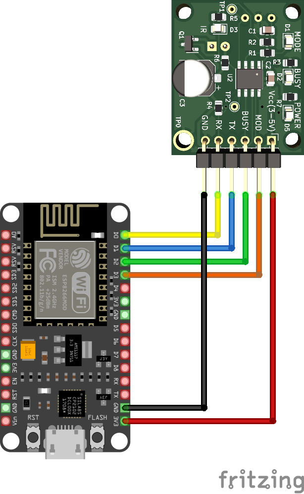

### ESP32:

- GPIO25 - BC7215A TX
- GPIO33 - BC7215A RX
- GPIO27 - BC7215A MOD
- GPIO26 - BC7215A BUSY
- 3.3V - BC7215A VCC

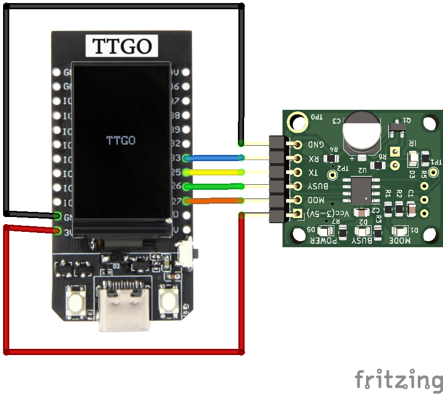 

## 串口监视器版

通过 Arduino IDE 的串口监视器使用，串口波特率为 115200。提供了 3 种不同的程序：ESP8266 阻塞式设计，ESP8266 非阻塞式设计，以及 ESP32 版。

- **阻塞式设计**：逻辑上最为简单，在完成一个操作之前，比如等待用户输入，程序会做无限循环查询，直到条件满足，适于用作了解驱动库的使用流程。
- **非阻塞版**：使用状态机机制，程序可以"同时"完成多项任务，不会卡在某个环节。
- **ESP32 版**：是 ESP8266 非阻塞版的 ESP32 移植。

不同版本的菜单界面相同。

程序上传到 Arduino 板后，即可在串口监视器内看到主菜单。如果没有显示，是因为程序上传后串口监视器的启动迟于程序的启动，此时直接输入回车或者重启 Arduino 板，即可看到主菜单显示。

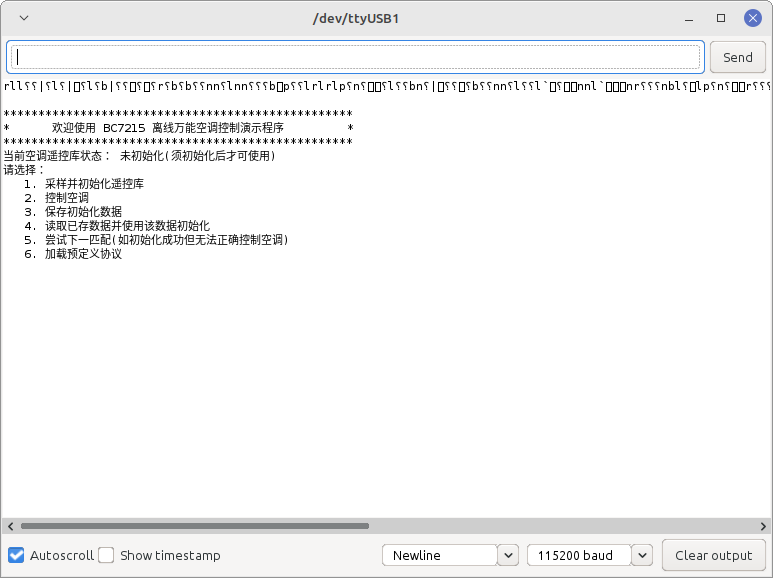

### 初次使用设置

初次使用时，应进行被控空调的遥控器的采样，并用采样数据进行遥控库的初始化。

初始化会分步进行，用户按照屏幕提示按步骤完成即可。通常将会初始化成功，如果多次尝试失败，且检查空调遥控器设置没有错误，则有可能所用的空调是极少数 BC7215A 无法直接解码的型号，这时可以逐个尝试使用"预定义协议"，测试是否可以控制。

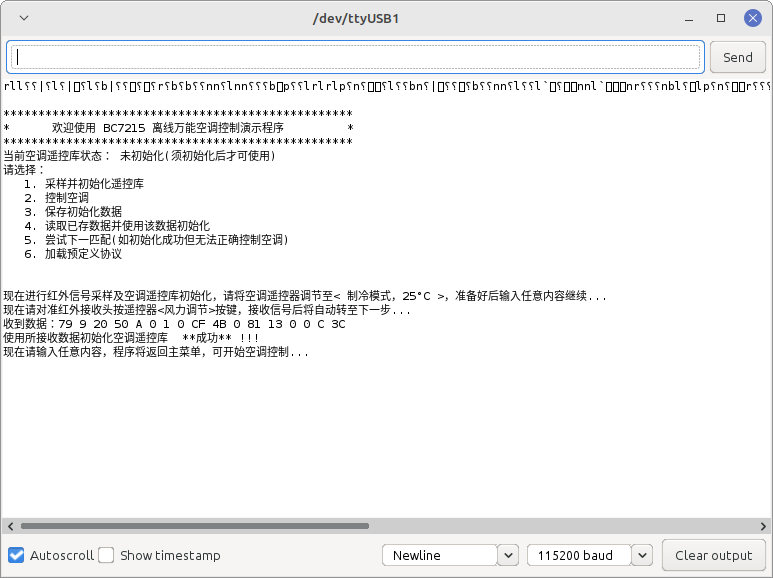

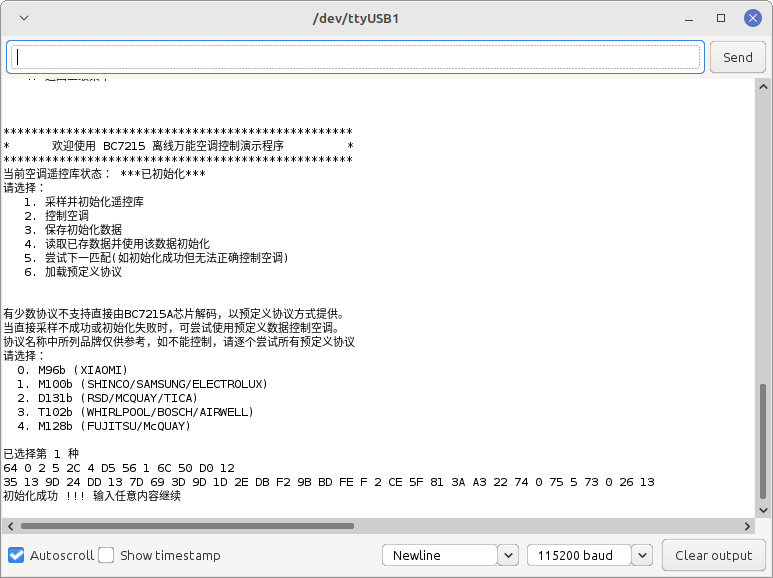

### 空调控制

初始化成功后即可开始控制空调，控制空调有 2 级菜单：

- 第一级选择控制类型，是温度等参数，还是开关机
- 第二级为参数输入，可以输入温度、工作模式、风力大小

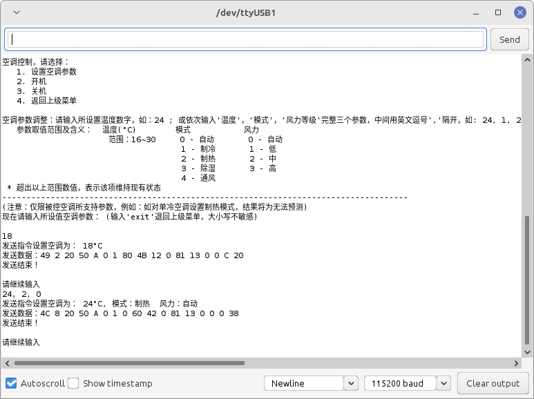 

## ESP32 LCD 版

LCD 版使用 TTGO T-Display 的 Arduino 板，自带 135x240 的液晶屏，驱动器为 ST7789，例子使用了 Bodmer 的 TFT_eSPI 库，可在 Arduino IDE 的库管理器中安装。

### 配置要求

该库需要用户根据硬件修改一个 User_Setup.h 的文件，该文件位于安装好的 TFT_eSPI 库的根目录，适合本例程的设置文件在所安装 BC7215AC 库的 extras/config 目录中，请将该目录中的 User_Setup.h 文件拷贝到 TFT_eSPI 库的根目录并替换同名文件。

### 操作说明

程序初次使用时，程序运行后，会进入菜单，用板上左键 SEL 选择菜单项，右键 OK 确认。

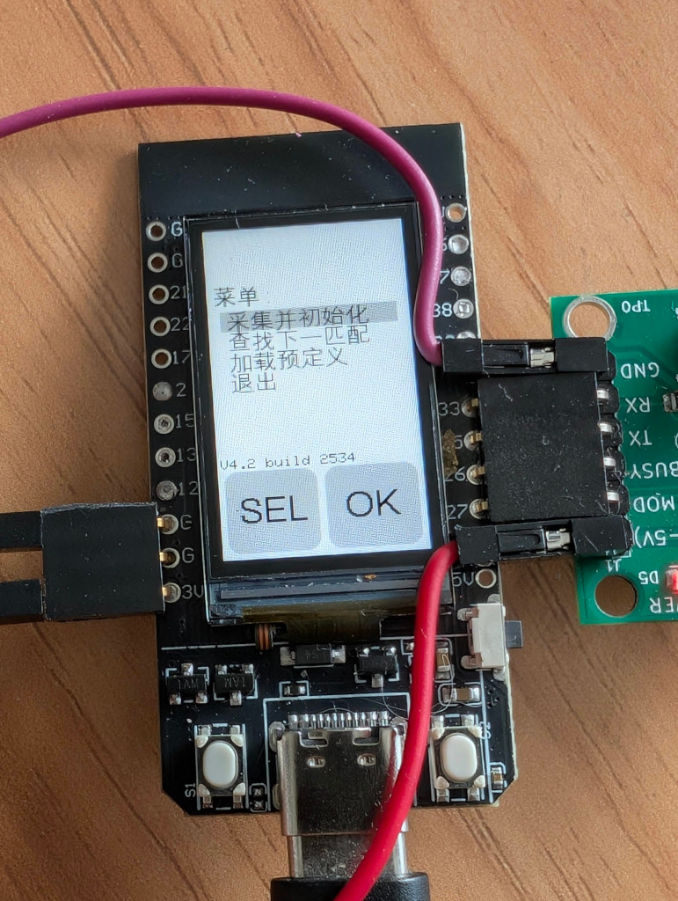

第一步请先进行初始化，按照屏幕提示完成遥控器信号的采集。

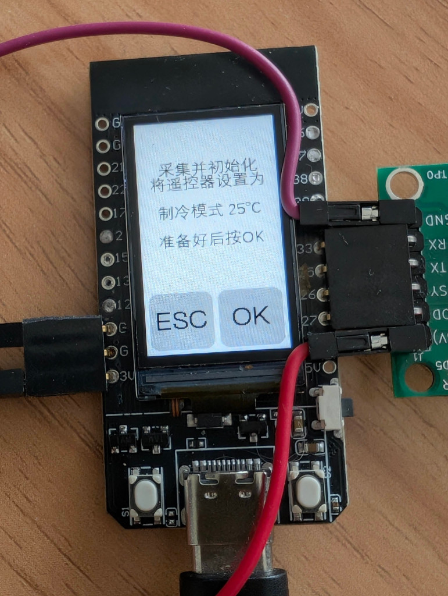

如果初始化成功，程序就会进入空调控制页面。

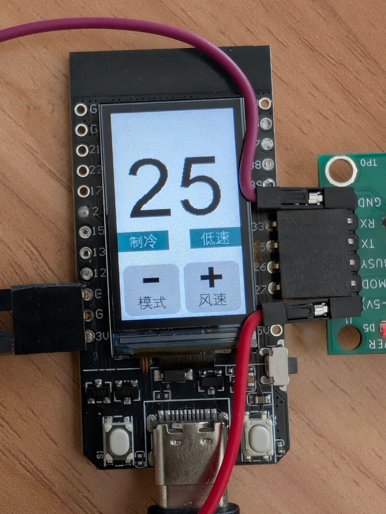

### 控制页面按键功能

- **左键短按** - 温度减
- **右键短按** - 温度加
- **左键长按** - 切换模式
- **右键长按** - 切换风速
- **双键短按** - 进入开关机页面，左右键变为开机/关机按键，分别发送开关机指令
- **双键长按** - 进入菜单

当所做操作会改变空调状态时，程序会驱动 BC7215A 芯片发射相应红外信号，同时屏幕右上角会有红外发射的指示标识。

## ESP32 MQTT 版

MQTT 版在 LCD 版的基础上增加了使用 MQTT 协议联网控制和空调状态上报的功能。MQTT 联网功能，使用的是 Nick O'Leary 的 PubSubClient 库，可从 Arduino IDE 的库管理器中安装。

MQTT 版的本机操作部分和 LCD 版完全相同，联网操作部分，请按照以下步骤进行：

### 1. 程序编译前准备

在程序编译之前，请先去掉源文件中以下几行的注释，并填入自己的内容，否则程序无法正常运行：

```cpp
// WiFi 和设备配置 - 请替换为您自己的值
// #define MY_WIFI_SSID "你的 WiFi 名称"     // 替换为您的 WiFi 名称
// #define MY_WIFI_PASSWORD "你的 WiFi 密码" // 替换为您的 WiFi 密码
// #define MY_UUID "你的 UUID"              // 使用 UUID 生成器创建唯一设备 ID
```

除了 WiFi 的名称和密码，请使用任何一种 UUID 生成器（网上有 UUID 生成器）生成你自己的 UUID，以确保唯一性，否则如果与他人使用相同的 UUID，当他人设备上线时，你的设备会被 MQTT 服务器踢下线。

一个 UUID 看起来如下面的格式：`b1225e25-81c8-43d7-8183-6f5793408242`

程序的 MQTT 代理(服务器)，默认使用 `broker.hivemq.com`，也可替换为任何支持不加密 1883 端口访问且不需要帐号/密码的公共 MQTT 代理服务器，如中国境内的 `broker.emqx.io`。

**注意：** 本示例仅为演示使用，使用的是不加密连接，生产环境中建议使用加密连接，以提高安全性。

### 2. 网络控制空调

程序开始运行后，即开始尝试 WiFi 连接，WiFi 连上后，就会开始尝试 MQTT 服务器的连接，当 MQTT 连接成功后，会在屏幕顶部看两个 WiFi 和 MQTT 的标志（假设空调遥控库已经初始化完成）。

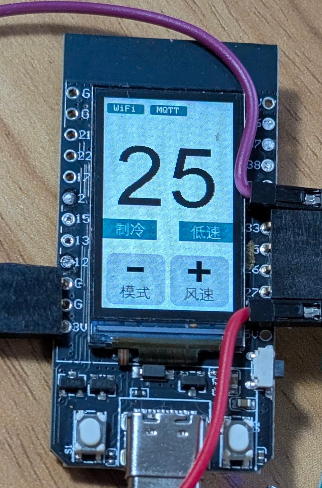

连接成功后，即可通过 MQTT 协议来控制空调。空调控制的话题(Topic)分别如下：

- **温度**：`BC7215A/（UUID）/var/temp`
- **模式**：`BC7215A/（UUID）/var/mode`
- **风力**：`BC7215A/（UUID）/var/fan`
- **电源**：`BC7215A/（UUID）/var/power`

其中 UUID 即为源程序中定义的 MY_UUID。实际的话题最终为类似下面的样子：
`BC7215A/b1225e25-81c8-43d7-8183-6f5793408242/var/temp`

发布控制消息时，内容为 ASCII 形式的数字，如温度为字符"16"至"30"，模式为"0"至"4"

#### 参数范围

**temp**: 范围 16-30 的整数

**mode**:

- 0 - 自动
- 1 - 制冷
- 2 - 制热
- 3 - 除湿
- 4 - 送风

**fan**:

- 0 - 自动
- 1 - 低
- 2 - 中
- 3 - 高

**power**:

- 0 - 关
- 1 - 开

## MQTT 客户端

一般公共免费 MQTT 服务器都会同时提供免费的客户端供用户使用，当然亦可以使用任何用户所习惯使用的 MQTT 客户端发布控制消息。

演示程序使用非加密连接，但发布控制消息的 MQTT 客户端，可以采用任何连接方式和连接端口，仅需连接同一个服务器且话题(topic)相同即可。

**hivemq.com 的网页版 MQTT 客户端**：https://www.hivemq.com/demos/websocket-client/

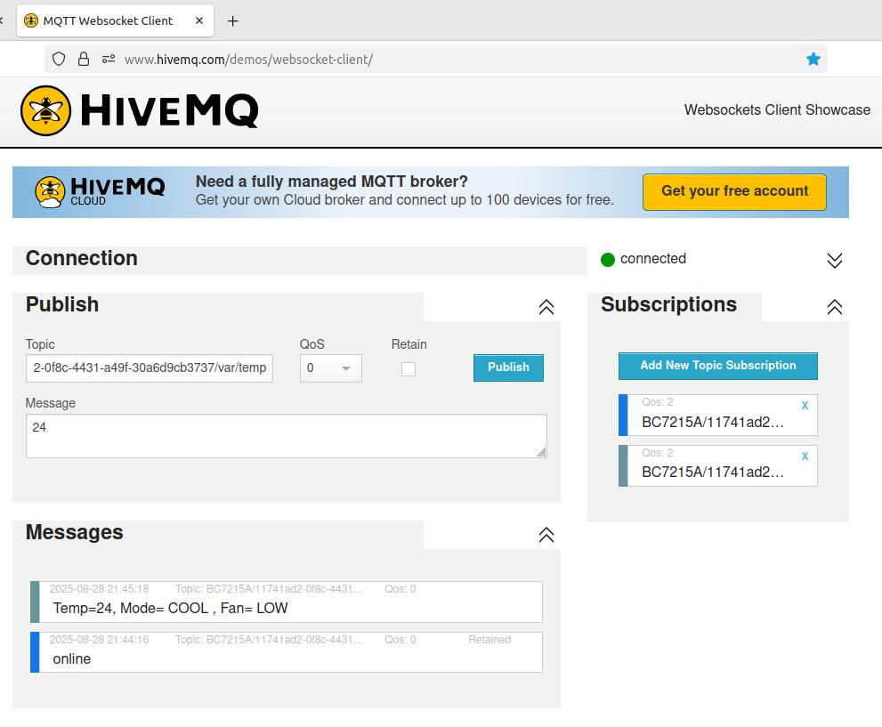

## 空调状态上报

每次发射红外指令改变空调状态，包括通过本机上按键操作，都会同时将状态上报至 MQTT 服务器，如果客户端订阅了报告话题，就会在客户端看到更新后的空调状态。

演示程序的报告话题是：`BC7215A/（UUID）/var/report`